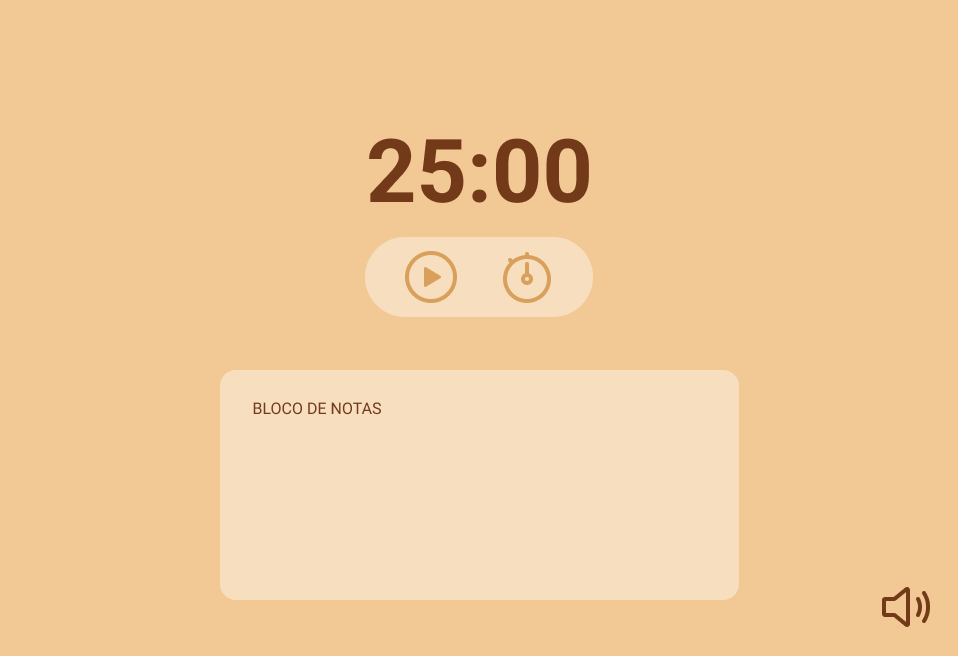

<h1 align="center"> Focus Timer </h1>

 

  <a href="#-tecnologias">Tecnologias</a>&nbsp;&nbsp;&nbsp;|&nbsp;&nbsp;&nbsp;
  <a href="#-descrição">Descrição</a>&nbsp;&nbsp;&nbsp;|&nbsp;&nbsp;&nbsp;
  <a href="#confira-o-projeto">Confira o projeto</a>&nbsp;&nbsp;&nbsp;

  

## 🚀 Tecnologias

Esse projeto foi desenvolvido com as seguintes tecnologias:

- HTML
- CSS
- JavaScript
- Figma
- Git e Github

---

 

## 💻 Descrição

Projeto de um temporizador pomodoro, contando com as seguintes funções:
- Temporizador funcional com painel de controle para iniciar, pausar, resetar e mudar o tempo do temporizador
- Bloco de notas para anotações em geral
- Música ambiente, podendo ser desligada e ligada por um botão no canto inferior direito

 

### 🔑 Acesse o projeto!

[⏰Focus Timer](https://eduvieira131.github.io/Focus-timer/)

---

## Confira o projeto:

  Uma pequena amostra sobre o que esperar do projeto!

 

  

